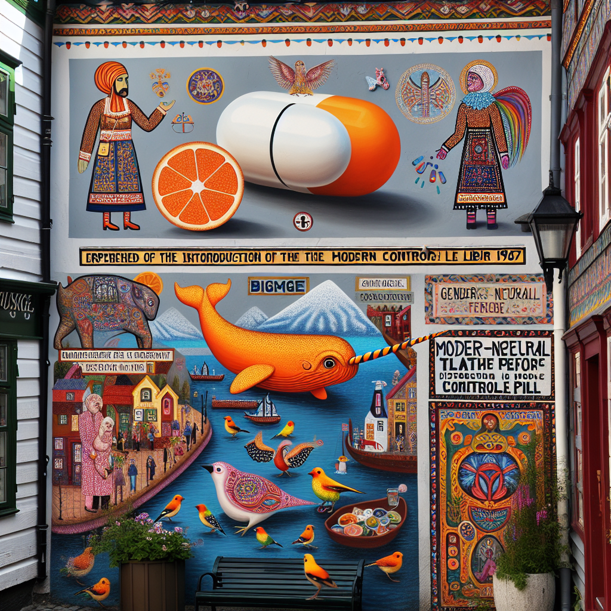

# 🚧 Funker ikke lengre

Morgenbladet har endret kviss-appen sin, så alt dette funker ikke lengre.

## Quiz fra Morgenbladet

Hver fredag kjøres en jobb:

- **Henter nyeste quiz fra morgenbladet og linker til den [her](https://jorgenbs.github.io/morgenbladet-kviss/).**

- Et lite [verktøy](./kviss-db) for å lagre spørsmål/svar fra en quiz-slug til sqlite-database

- Generer tematisk KI-bilde basert på innhold av siste quiz

- Pushvarsel til mobil når en ny quiz er tilgjengelig: installer https://ntfy.sh og abonner på "mbkviss".

kviss.morgenbladet.no har tilsynelatende bare innhold datert tilbake til `kviss-uke-4-2022`, etter det så ligger det som ymse formater i CMS'et deres

### Tematisk KI-bilde fra siste quiz:

